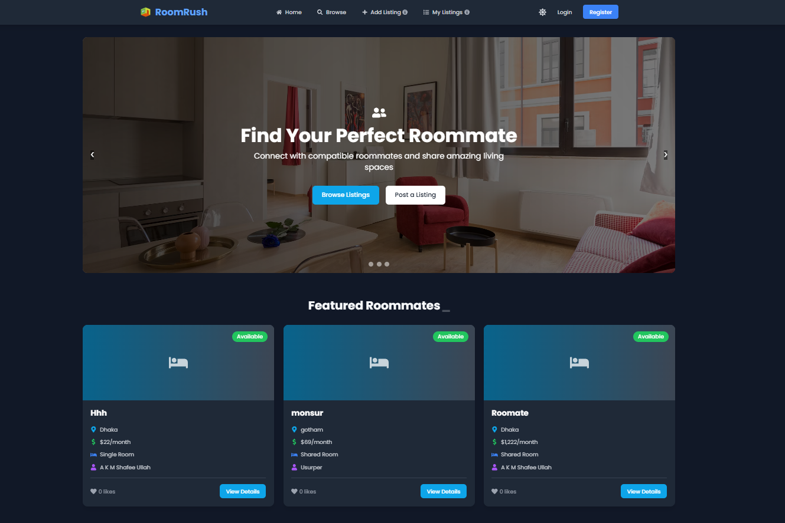

# 🏠 RoomRush

RoomRush is a modern web application designed to help users find roommates and shared living spaces. Built with React, Firebase, and MongoDB, it provides a seamless experience for both property listers and seekers.

#LiveURL:

https://roomrush-796cb.web.app/

## ✨ Key Features

- **🔐 Secure Authentication System**
  - Firebase Authentication integration
  - Google Sign-in support
  - Protected routes and secure API endpoints
  - Profile management with photo upload capability

- **📝 Advanced Listing Management**
  - Create and manage room listings
  - Rich text description support
  - Upload multiple photos
  - Set preferences and requirements
  - Filter listings by various criteria

- **👥 Smart Roommate Matching**
  - Detailed user profiles with preferences
  - Lifestyle compatibility indicators
  - Direct messaging between users
  - Save favorite listings
  - View matched roommate suggestions

- **💫 Modern User Interface**
  - Responsive design for all devices
  - Dark/Light theme support
  - Real-time updates
  - Intuitive navigation
  - Toast notifications for user feedback

- **🛡️ Robust Backend**
  - MongoDB database integration
  - RESTful API architecture
  - JWT token authentication
  - Real-time data synchronization
  - Secure user data handling

## 🚀 Technologies Used

- **Frontend:**
  - React.js
  - Tailwind CSS
  - Firebase Auth
  - React Router
  - React Icons

- **Backend:**
  - Node.js
  - Express.js
  - MongoDB
  - Firebase Admin SDK
  - JWT

## 🔧 Environment Setup

1. Clone the repository
2. Install dependencies:
   ```bash
   npm install
   ```
3. Create a `.env` file with the following variables:
   ```env
   FIREBASE_PROJECT_ID=your_project_id
   DB_USER=your_db_user
   DB_PASS=your_db_password
   ```
4. Start the development server:
   ```bash
   npm run dev
   ```

## 📱 Screenshots

### Homepage

*Homepage featuring the roommate finder interface with featured roommate listings*


